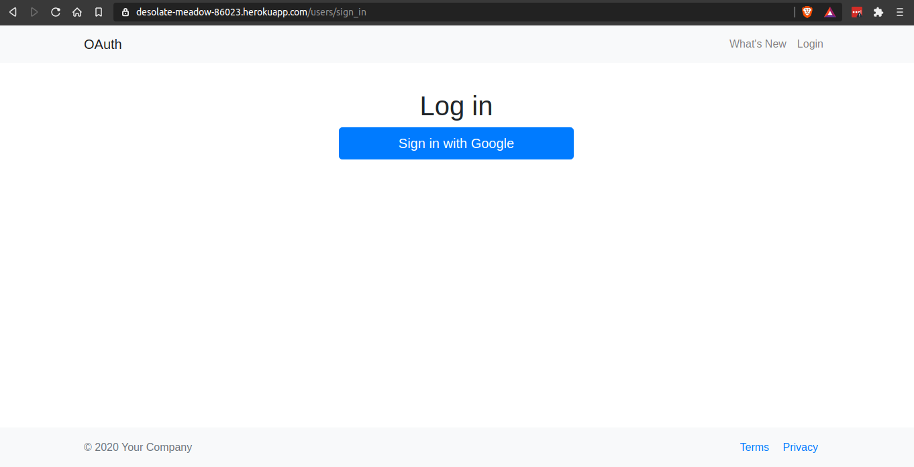
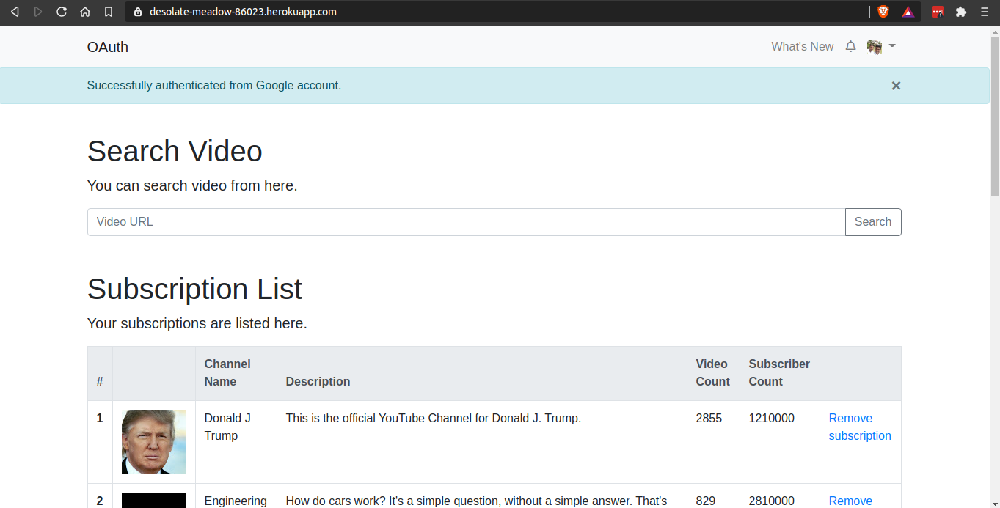

# My Youtube Patrol

This application is based on the Ruby on Rails web framework 
and can be used to view your youtube statistics in one place. You can
login from a youtube enabled gmail account to access the application
using OAuth 2.0 framework.

<p>
  
  
  
</p>

## Features

- OAuth2.0 framework authorization using Google
- Show user's youtube profile details
- Search youtube video by url and show normal and technical details
- Remove subscriptions from the channels user currently subscribed to

## Screenshots





## Development Environment Setup (Prerequisites)

### Rails Installation (Windows)

First, check if you already have Ruby installed. Open the command prompt and type
```ruby -v```. If Ruby responds, and if it shows a version number at or above 2.2.2, 
then type ```gem --version```. If you don't get an error, skip Install Ruby step. Otherwise,
you have to install a fresh Ruby.

#### Install Ruby

If Ruby is not installed, then download an installation package from [rubyinstaller.org](https://rubyinstaller.org/).
Follow the download link, and run the resulting installer. This is an exe file rubyinstaller-2.7.1-x-x64.exe and will be installed in a single click.
It's a very small package, and you'll get RubyGems as well along with this package.
Please check the Release Notes for more detail.

#### Install Rails

With Rubygems loaded, you can install all of Rails and its dependencies using the following command through the command line:

```
> gem install rails
> rails -v

# output
> Rails 6.0.3
```
#### Database Install

Database used in this application is PostgreSQL database.
To install PostgreSQL on your computer, 
you can download it from the [official site](https://www.postgresql.org/) 
or by using the [download link for windows](https://www.postgresql.org/download/windows/). 
Once you’re on the right page, click the **Download the installer** link.

After the file has been download start the installation process by clicking on the .exe file. 
Continue clicking on Next button of the installer until the password reset page of the **postgres** user.
Chose a password and continue hitting next. After all of those steps you will be able to install postgresql. 


### Rails Installation (Linux)

We are installing Ruby On Rails on Linux using rbenv. 
It is a lightweight Ruby Version Management Tool. 
The rbenv provides an easy installation procedure to manage various versions of Ruby,
and a solid environment for developing Ruby on Rails applications.

Follow the steps given below to install Ruby on Rails using rbenv tool.

#### Install Prerequisite Dependencies

First of all, we have to install git - core and some ruby dependencies that help to install Ruby on Rails.
Use the following command for installing Rails dependencies using yum.

```
$ sudo yum install -y git-core zlib zlib-devel gcc-c++ patch readline readline-devel libyaml-devel libffi-devel openssl-devel make bzip2 autoconf automake libtool bison curl sqlite-devel
```

####  Install rbenv

Now we will install rbenv and set the appropriate environment variables.
Use the following set of commands to get rbenv for git repository.

```
$ git clone git://github.com/sstephenson/rbenv.git .rbenv
$ echo 'export PATH = "$HOME/.rbenv/bin:$PATH"' >> ~/.bash_profile
$ echo 'eval "$(rbenv init -)"' >> ~/.bash_profile
$ exec $SHELL

$ git clone git://github.com/sstephenson/ruby-build.git ~/.rbenv/plugins/ruby-build
$ echo 'export PATH = "$HOME/.rbenv/plugins/ruby-build/bin:$PATH"' << ~/.bash_profile
$ exec $SHELL
```

#### Install Ruby

Before installing Ruby, determine which version of Ruby you want to install. We will install Ruby 2.7.1.
Use the following command for installing Ruby.

```
$ rbenv install -v 2.7.1

$ rbenv global 2.2.3
$ ruby -v

# output
$ ruby 2.7.1p83 (2020-03-31 revision a0c7c23c9c) [x86_64-linux]
```

Ruby provides a keyword gem for installing the supported dependencies; we call them gems. 
If you don't want to install the documentation for Ruby-gems, then use the following command.

```
$ echo "gem: --no-document" > ~/.gemrc
$ gem install bundler
```

#### Install Rails

Use the following command for installing Rails version 4.2.4.

```
$ install rails -v 6.0.3
$ rbenv rehash
$ rails -v

# output
$ Rails 6.0.3
```
#### Install JavaScript Runtime

Ruby on Rails framework requires JavaScript Runtime Environment (Node.js) to manage the features of Rails. 
Next, we will see how we can use Node.js to manage Asset Pipeline which is a Rails feature.
```
$ sudo yum -y install epel-release
$ sudo yum install nodejs
```

#### Database Install

Database used in this application is PostgreSQL database.
Therefore use the following commands to install PostgreSQL.

```
$ sudo postgresql-setup initdb
$ sudo systemctl start postgresql
$ sudo systemctl enable postgresql
```

Please change the password of the **postgres** user or create new user with
```CREATEDB``` privileges.

## Application Configuration

### Google OAuth Credentials

All of the authentication details with the google OAuth2.0 in the credentials file.
Nevertheless with the ```master.key``` to open the credentials file this does not work.
Please add the credentials details that specified in the report.

You can edit the credentials file by a terminal in the application path with the following command:
```
$ EDITOR=vim rails credentials:edit
```

### Database connection

The database configuration file config/database.yml comes with information about installing the pg gem. 
Along with other option settings, you may change if you deviate at any point with your PostgreSQL setup. 
Here is the relevant development connection information

```yaml
default: &default
  adapter: postgresql
  encoding: unicode
  host: localhost
  user: 'postgres'
  password: 'password'
  pool: <%= ENV.fetch("RAILS_MAX_THREADS") { 5 } %>

development:
  <<: *default
  database: ssd_oauth_assignment_ror_development

test:
  <<: *default
  database: ssd_oauth_assignment_ror_test

production:
  <<: *default
  database: ssd_oauth_assignment_ror_production
  username: ssd_oauth_assignment_ror
  password: <%= ENV['SSD_OAUTH_ASSIGNMENT_ROR_DATABASE_PASSWORD'] %>
```

For the database use connection I have used the **postgres** user and the password of that user.
You can use any user with ```CREATEDB``` privileges and relevant password. Please change those configuration
before proceeding. 

### Database Creation and Migration

Once application is successfully connected to the database server, use this command to create and migrate the database:

```
# This creates a database
$ rails db:create

# This creates tables etc. on the database
$ rails db:migrate
```

### Starting Up the Rails Server

To startup the Rails server, make sure that you are in the root of the application in the terminal and run:

```
$ rails s
```

After server has been started you can go the [localhost:3000](http://localhost:3000) to interact with the application.
Before running the server make sure above steps has been completed successfully.

## License

My Youtube Patrol is released under the [MIT License](https://opensource.org/licenses/MIT).

## Developer

[K.B.R. Perera](https://github.com/randikabanura) <br/>
IT17134286 <br/>
[randika.banura@gamil.com](mailto:randika.banura@gamil.com) <br/>
Sri Lanka Institute of Information Technology (SLIIT)